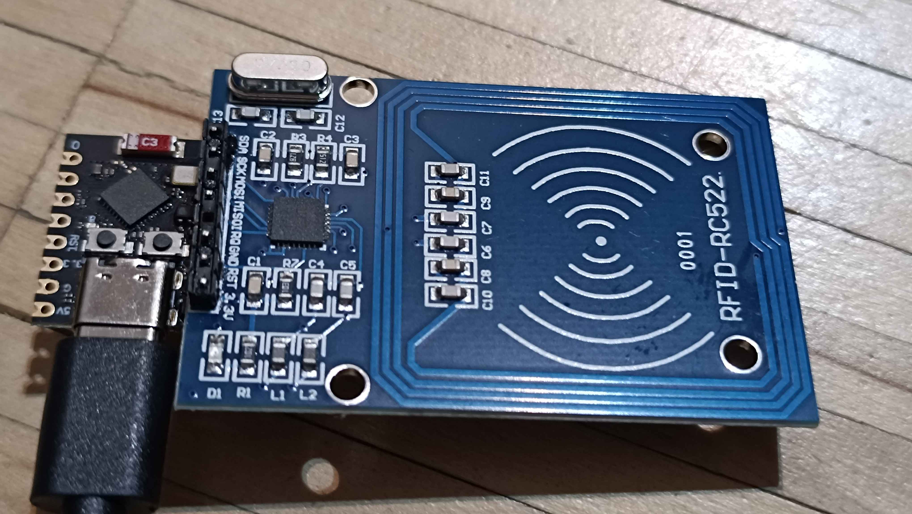
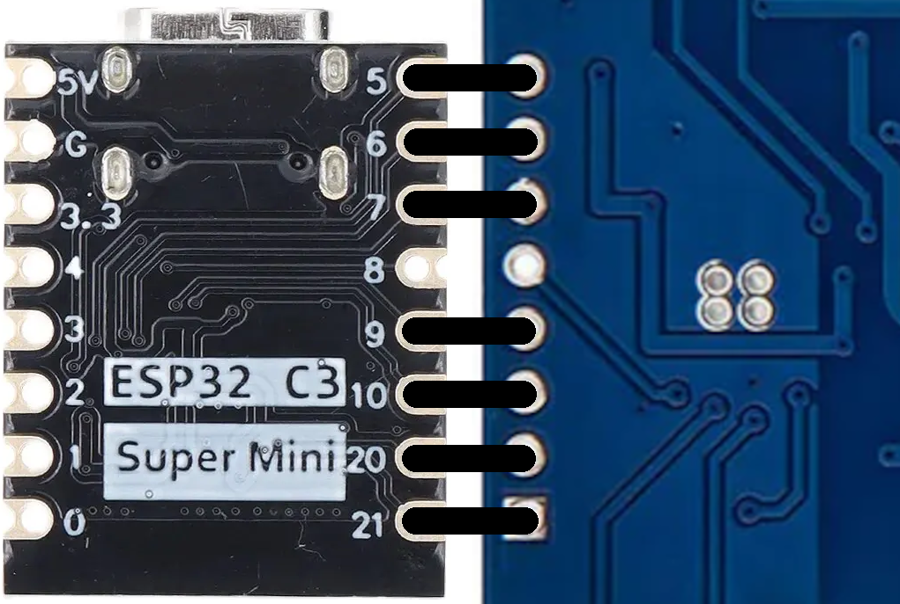

Attendance tracker using NFC tags

Program NFC tag via android phone, user scans tag -> database is updated with name + date and time of scan

# Building the scanner device

Components:
- ESP32-C3 SuperMini
- RFID-MFRC522

Wiring:

# Programming the scanner device

1) Connect device to PC via USB datacable

2) `pip install esptool mpremote`

3) Run `DIGI-AWL_Client_Installer.py` and pass IP of computer which will run the server for the device, optionally also with a custom port (default is 55555), and if you're not directly connecting to the network via ethernet then also WiFi SSID and password

# Usage

(Supported NFC tags are: **NTAG215** and **NTAG216**)

1) `pip install bottle`

2) Run `DIGI-AWL_Server.py`, optionally pass custom port (default is 55555) which matches the one you programmed the device with, and also optionally a custom password for the web interface (default is "DIGI-AWL")

3) Connect scanner device to powered USB port or phone charger (order doesn't matter for 2. and 3.)

4) Visit https://geetwentyfive.github.io/DIGI-AWL/ in a chromium(-based) browser on an Android phone, make sure NFC is enabled, enter name of person, tap `Write`, place NFC tag near phone's transciever (on success, it should say "Written: " followed by what you wrote in the input text field)

5) User should now be able to hold NFC tag next to device to scan it (successful scan shown by LED turning on then off once after bringing tag close, should flash multiple times instead on error)

To see and manage entries in the database, navigate to `http://<IP_ADDRESS_OF_SERVER_COMPUTER>` in a browser and then pass password in password field (default is "DIGI-AWL") (`http://localhost` should work if accessing on same computer)